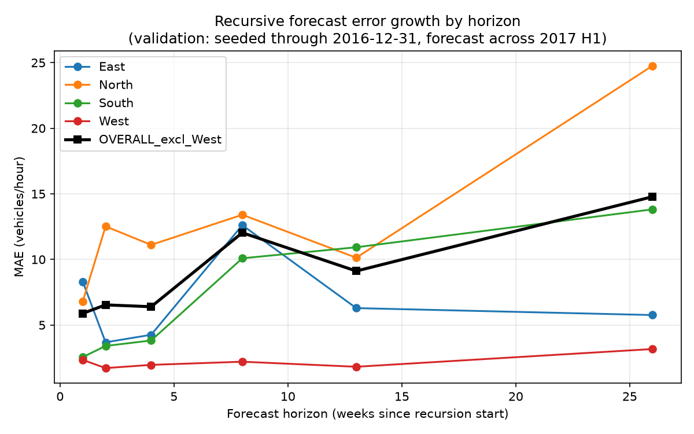

# Recursive Forecast Degradation

Validation protocol: seeded on real data through 2016-12-31 23:00:00 only, forecast recursively across 2017-01-01 00:00:00 to 2017-06-30 23:00:00 (4344 hours), compared against the real actuals for that window (ADR-008's held-out test period). No real 2017 data was used as a forecast input - only the model's own prior predictions, fed back through the history buffer exactly as --mode deliverable does. See DECISIONS.md's recursive-forecast ADR.

MAE by forecast horizon, bucketed at weeks 1, 2, 4, 8, 13, 26. OVERALL_excl_West per ADR-011.

| Week | Hours (horizon) | East | North | South | West | OVERALL_excl_West |
|---|---|---|---|---|---|---|
| 1 | 1-168 | 8.299 | 6.806 | 2.558 | 2.340 | 5.888 |
| 2 | 169-336 | 3.682 | 12.522 | 3.405 | 1.716 | 6.536 |
| 4 | 505-672 | 4.257 | 11.108 | 3.822 | 1.963 | 6.395 |
| 8 | 1177-1344 | 12.611 | 13.405 | 10.088 | 2.204 | 12.035 |
| 13 | 2017-2184 | 6.290 | 10.130 | 10.927 | 1.818 | 9.116 |
| 26 | 4201-4344 (partial) | 5.760 | 24.764 | 13.816 | 3.170 | 14.780 |

Week 26 / week 1 ratio, OVERALL_excl_West: 14.780 / 5.888 = **2.51x**.

Error grew by 2.51x across the horizon measured here, under the 3x threshold used elsewhere in this project to call an effect large. Stated as measured, not rounded up.

REQUIRES HUMAN READ: the plot above asserts, and only a human read can confirm, that (1) each road's line is monotonically labelled and coloured consistently with the legend, (2) the OVERALL_excl_West line (black, heavier) excludes West as claimed, and (3) the shape of the curve (flat, rising, or erratic) matches the numbers in the table above rather than an artifact of the plotting library's default axis scaling.
